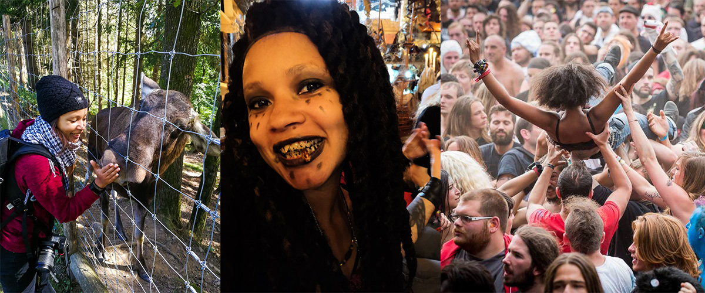

# Hellow and welcome on my GitHub profile 👋🏾

My name is Nath(alie) and I am a junior front-end developer, living in Brussels and studying at [BeCode](https://becode.org/learn/junior-web-developer/). I am currently looking for a two-months internship (*not in remote pleeeaaaaaase* 🙏🏾 ) for august and september 2021 ! 

## 🔨 I’m currently working on ...

<!-- - [JS Snake](https://github.com/nathalie-anneessens/js-snake)
- [JS RPG](https://github.com/nathalie-anneessens/js-rpg)
- [Vue.JS 101](https://github.com/nathalie-anneessens/Vue.js-101) -->
    

## 💪🏾 I worked on... 
<!-- |||
| - | - | -->
|||
| :---: | :---: |
||  |

---

## 📚 I've learned to use...

 
 
 

  

## 📖 I'm currently learning... 

 

  

## 🧾 I also want to learn...

 
 

 
<strong>and any other language you may need !</strong>  

---

## 🖥️ I can do some stuff with...

 <em>...But don't ask me to make a page layout with MS Word! </em>🥺

---

## 🤝 I’m looking for ...
A two-months internship (Or three-months if you want to keep me and offer me a job after its end 🤞🏾 )

---

## 📫 How to reach me: ...

---

## 👀 "Some" stats

<!--  -->

## 🤪 Funs facts

I love to photograph nature and animals, I look like Tia Dalma/Calypso and enjoy music and metal festivals 🤘🏾

 

<!-- RESSOURCES : -->

<!--GITHUB PROFILE 101 TUTORIAL :  
- https://dev.to/supritha/how-to-have-an-awesome-github-profile-1969 -->

<!-- STATS : 
- https://github.com/anuraghazra/github-readme-stats>
- https://github.com/DenverCoder1/github-readme-streak-stats -->

<!-- BADGES : 
- https://naereen.github.io/badges/
- https://github.com/Ileriayo/markdown-badges -->

<!-- COLOR EMOJIS : 
- https://emojipedia.org/emoji/ -->

<!--  PHOTOGRAPHER FROM MOTOCULTOR 2015 : 
- François Lampin -->
